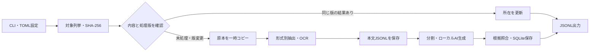

# 基本設計

更新日：2026-09-28。本書は現在の実装を基準に記述します。完成時の要求は[要件定義](requirements.md)、残作業は[開発計画](development-plan.md)を参照してください。

## 処理の流れ

通常の`run`は夜間枠内でのみ進み、`--ignore-window`で手動実行できます。`--extract-only`または`llm.enabled=false`では原文の抜粋を暫定メタデータにします。入力は読取専用で扱い、スナップショットと処理後の原本ハッシュを照合します。処理中に原本が変われば、そのパスに結果を公開しません。

## 実装済みモジュール

| パス | 責務 |
| --- | --- |
| `cli.py`, `config.py` | CLI、単一起動ロック、実装済み設定の読込・検証 |
| `scanner.py` | 再帰走査、全量SHA-256、スナップショット、版判定、JSONL出力 |
| `extractors.py`, `ocr.py` | 形式別テキスト抽出、保護の一部検出、Tesseract呼出し |
| `metadata.py` | AIを使わない暫定メタデータと日本語キーワード候補 |
| `llm_metadata.py`, `local_llm.py` | 分割、根拠付き事実、CPU版llama.cppの起動と生成 |
| `repository.py` | SQLiteの内容・所在・実行・エラー・OCR単位結果・AI分割結果 |

## 抽出とOCRの境界

- `docx`：本文の段落・表、ヘッダー・フッターを取得。`pptx`：スライドのテキスト・表・グループ図形・任意のノートを取得。`xlsx`：表示対象シートの非空セルを読取専用で取得し、数式は保存済み結果だけを使用します。
- Officeの`word/media/`、`ppt/media/`、`xl/media/`内の画像をOCRします。現状の位置識別子は`media:...`で、画像とページ・スライド・セルの対応付けはありません。
- `pdf`：pypdfで各ページの文字を取得し、OCR有効時はpypdfium2で**全ページ**を描画してTesseractに渡します。同じページの文字行が完全一致するときだけOCR結果から除きます。画素上限を超えるページは警告してOCRを省略し、タイル分割は未実装です。
- 任意の`txt/md`はUTF-8を読み、設定時のみCP932を許可します。旧Officeの`ppt/doc/xls`は設定時に拒否します。
- 暗号化PDF、暗号化Officeコンテナ、検出できたWord編集保護・Excelブック/シート保護・PowerPoint変更保護を`PROTECTED`にします。検出範囲の網羅性は未評価です。

## 重複、版、再開

内容IDはファイル全体のSHA-256です。毎回全量を読み、同一内容・同一処理版なら抽出とAI生成を省略します。抽出版は抽出ライブラリ、OCR資産のサイズ・更新時刻、主要設定から計算します。生成版は抽出版、モデルSHA-256、llama.cpp実行物のサイズ・更新時刻、プロンプトと生成設定から計算します。生成版だけが変われば保存済み本文を再利用します。

SQLiteの`runs`、`contents`、`paths`、`errors`、`ocr_units`、`llm_chunks`を使います。本文は`var/cache/<sha256>-<extraction_version>.jsonl`に原子的に保存します。PDFページ・Office内部画像のOCR文字列は`ocr_units`に、AI分割ごとの事実は`llm_chunks`に単位ごと保存します。キーは内容SHA-256・抽出版・位置識別子なので、原本や抽出設定が変わった結果は流用しません。中断した文書は先頭から抽出し直しますが、完了済みOCRは再認識しません。永続ジョブとネイティブ本文抽出の途中カーソルはありません。DBスキーマは起動時の簡易な列追加で更新し、独立した移行管理は未実装です。

## 日本語メタデータと出力

本文を保守的な文字数で分割し、チャンクごとに出典識別子と引用を伴う事実を生成します。引用の原文一致を検査し、長文では検証済み事実から番号で選んで圧縮します。最終結果のJSON形式・文字数・数値の原文存在・キーワードの本文存在を確認します。内容の意味や固有名詞の正しさは自動保証できないため、出力はすべて`review_required`です。AI生成が失敗した本文は保持して次回再試行します。本文が空ならファイル名を用いた暫定レコードにします。

全入力ルートを完走できた実行だけ、`var/export/catalog.jsonl`、`errors.jsonl`、`run.json`を書きます。カタログとエラーのJSONLは一時ファイルから置換します。`run.json`は直接上書きで、3ファイル一組の世代切替はありません。スキーマは[JSON Schema](../schemas/catalog-record.schema.json)を参照してください。

## 次の設計課題

画像の本文位置への対応、OCR品質と重複除去、ネイティブ本文抽出の途中再開、メモリ・ディスク監視、1回のOCR呼出し中の期限制御、世代別出力、明示的な再試行管理を追加します。16GBの実機と日本語評価文書で資源量・精度を測ってから運用条件を確定します。
